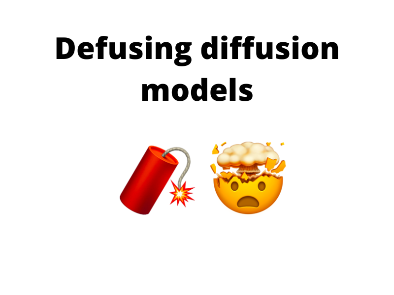

# defusing-diffusion
Official code for the "Defusing Diffusion Models" blog post on perceptron.blog

Implementation of some Diffusion Models in PyTorch for the [blog post](https://perceptron.blog/posts/defusing-diffusion/) on [perceptron.blog](https://perceptron.blog).

### Notebooks
| Notebook                            | Description                                                   | Link                                                                                                                                                                                            |
|-------------------------------------|---------------------------------------------------------------|-------------------------------------------------------------------------------------------------------------------------------------------------------------------------------------------------|
| `diffusion.ipynb`                   | Implementation of the diffusion models                        |          |
| `diffusion_classifier_guided.ipynb` | Implementation of the classifier guided diffusion models      |  |
| `diffusion_classifier_free.ipynb`   | Implementation of the classifier-free guided diffusion models |    |
